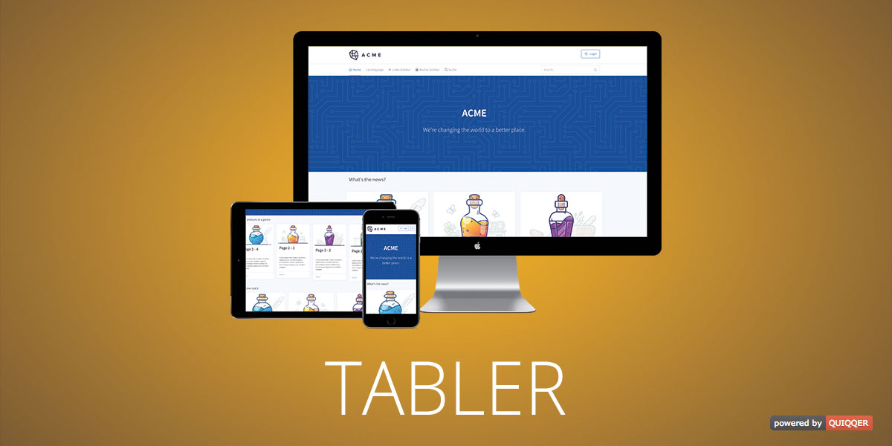

Tabler Template for QUIQQER
------

This Template is a ported version from Tabler for QUIQQER.

Tabler is free and open-source HTML Dashboard UI Kit built on Bootstrap 4.
Premium and Open Source dashboard template with responsive and high quality UI.

https://github.com/tabler/tabler

Package name:

    quiqqer/template-tabler
    
    
Features
--------

- Responsive
- FontAwesome support
- Layouts
- Integrated User Profile
- Cross Browser

Installation
------------

The package name is: quiqqer/template-tabler

Contribute
----------

- Issue Tracker: https://dev.quiqqer.com/quiqqer/template-tabler/issues
- Source Code: https://dev.quiqqer.com/quiqqer/template-tabler/tree/master

Support
-------

If you have found errors, wishes or suggestions for improvement,
you can contact us by email at support@pcsg.de.

We will try to meet your needs or send them to the responsible developers
of the project.

License
-------

- GPL-3.0+
